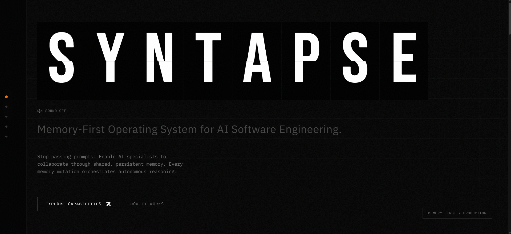
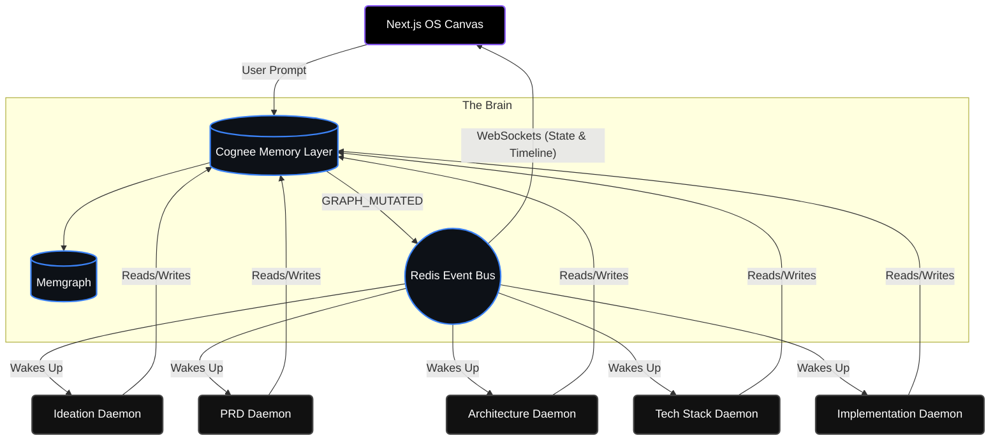
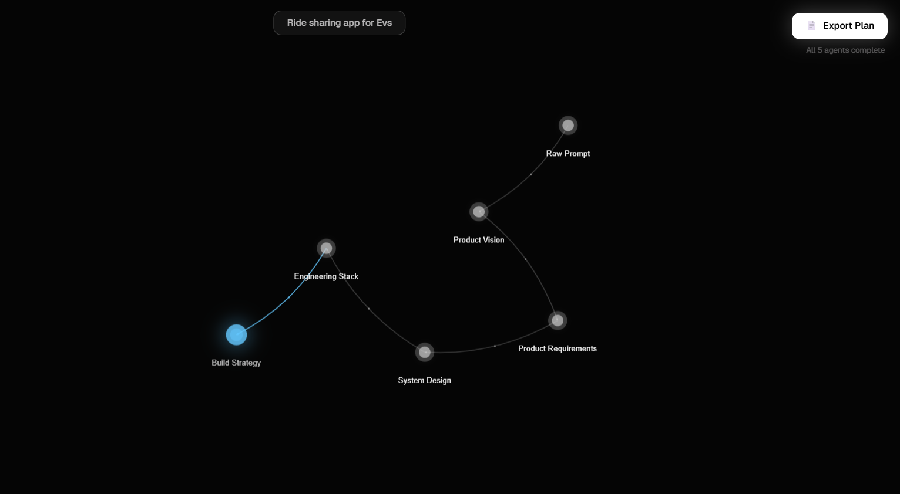
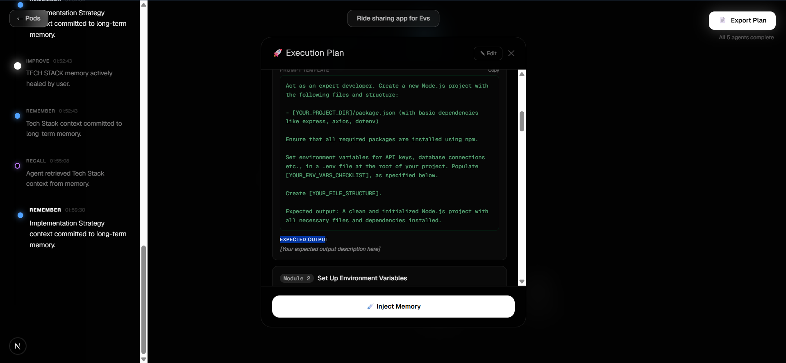

# Syntapse

### The Memory-First Operating System for AI Software Engineering

## 🎥 Demo Video

### 👉 Click the image below to watch the full demo

**Or watch here:** https://youtu.be/rS-OEcSBRpg

---

📖 **Technical Blog:** https://dev.to/yaser-123/we-stopped-passing-prompts-we-started-sharing-memory-3b3k

🏆 **Built for:** Cognee – *The Hangover Part AI: Where's My Context?* Hackathon  
Organized by **WeMakeDevs**

---

Syntapse is a **memory-first AI software engineering platform** where specialized AI agents collaborate through a shared, evolving memory powered by **Cognee**.

Instead of passing prompts between agents, every specialist reads from and writes to the same persistent memory graph. This enables AI teams to plan, adapt, verify, and continuously evolve software without losing context.

## 🛑 The Problem

Software engineering is inherently collaborative and highly contextual. Yet, when we try to automate it with AI, we force models to work in isolation. We pass massive walls of text (prompts) between models, hoping they don't hallucinate or forget critical requirements. 

## ❌ Why Existing AI Agent Systems Fail

Today's agent frameworks rely on **Sequential Prompt Chaining**. 
Agent A generates text. It passes that text to Agent B. Agent B passes it to Agent C.

When requirements change, or when Agent B makes a mistake, the chain shatters. The context is lost, the output degrades, and the only solution is to hit "re-run" and start from scratch. Existing systems fail because they treat context as a temporary payload, rather than a permanent state of truth.

## 💡 Our Solution

**We stopped passing prompts. We started sharing memory.**

Syntapse deploys five highly specialized, autonomous AI daemons:
1. **Ideation Specialist**
2. **Product (PRD) Architect**
3. **System Architect**
4. **Tech Stack Evaluator**
5. **Implementation Strategist**

*None of these agents communicate directly with each other.* 

Instead, they observe a shared **Cognee Memory Graph**. When the PRD agent finishes writing requirements, it commits that knowledge to long-term memory. The downstream System Architect observes this memory mutation, wakes up, recalls the exact context it needs, and begins its work. 

## 🚀 Core Innovation: Autonomous Healing

Because Syntapse is event-driven around a memory graph, it can **heal itself**. 
If a user manually intervenes and edits a memory node (e.g., changing the Tech Stack from React to Rust), Syntapse doesn't need to be restarted. The edited memory emits a shockwave event. Downstream agents instantly detect the anomaly in their foundation, shatter their stale plans, and autonomously regenerate new implementations based on the updated truth.

## 🏗️ Architecture

## 🧠 Memory Lifecycle

Syntapse translates raw backend execution into a spatial "Thread of Consciousness" on the frontend UI:
- 🔵 **Remember:** An agent commits a refined concept to the Cognee graph.
- ⚪ **Recall:** An agent queries the graph for historical context.
- 🌟 **Improve:** A human explicitly injects new truth into a memory node.
- 🌫️ **Forget:** A downstream agent discards a stale plan because its foundational memory was altered.

## 🔄 Agent Lifecycle

Our agents run as background daemons, completely decoupled from the UI. 
1. **Observe:** Listen to the Redis event bus for memory mutations.
2. **Evaluate:** Query Cognee to check if their specific responsibility (e.g., generating an Architecture plan) is missing or invalidated.
3. **Act:** Retrieve necessary context, invoke LLMs, and commit the new state back to Cognee.
4. **Sleep:** Return to observation mode.

## 🎮 Demo Walkthrough

1. **The Seed:** Enter a raw project idea into the sleek prompt interface. Watch it shatter into the initial `Raw Prompt` node.
2. **The Neural Expansion:** Take your hands off the keyboard. Watch the 3D canvas organically expand. Liquid synapses connect pulsing nodes as agents retrieve context and forge new memories in real-time.
3. **The Thread of Consciousness:** Watch the left-hand timeline populate with human-readable cognitive events, proving the AI is actually using memory, not hardcoded scripts.
4. **The Mic Drop (Healing):** Click the `Tech Stack` node. In the spatial popover, edit the JSON data to change a core technology. Click **"Inject Memory"**. Watch a visual shockwave ripple through the graph, instantly shattering downstream nodes and forcing them to regenerate based on your new truth.

## 🛠️ Technology Stack

- **Memory Infrastructure:** Cognee, Memgraph
- **Event Orchestration:** Redis (Pub/Sub)
- **Backend Services:** Python, FastAPI, asyncio
- **Frontend OS Interface:** Next.js (React), framer-motion, react-force-graph

## 🏆 Why Cognee?

Syntapse is only possible because of Cognee. Standard vector databases cannot handle the hierarchical, relational constraints of software engineering. Standard graph databases lack the semantic search required for AI context retrieval. 

Cognee provides the perfect synthesis: **A memory graph that understands semantic meaning.** It allows our agents to not just store data, but to store *relationships*, enabling the autonomous self-healing ecosystem that powers Syntapse.

## 📸 Screenshots

*The 3D Canvas organically growing as agents commit memories.*

*Injecting new truth via the Spatial Card interface.*

## 🚀 Future Roadmap

- **Multi-Player Memory:** Allow entire engineering teams to connect their IDEs directly into the Syntapse memory graph.
- **Code Generation Agents:** Add terminal-enabled daemons that execute the implementation plans generated by the current strategy agents.
- **Memory Snapshots:** Version control for the digital brain, allowing users to branch, fork, and revert entire project cognitive states.

---
*Syntapse. Stop prompting. Start remembering.*
